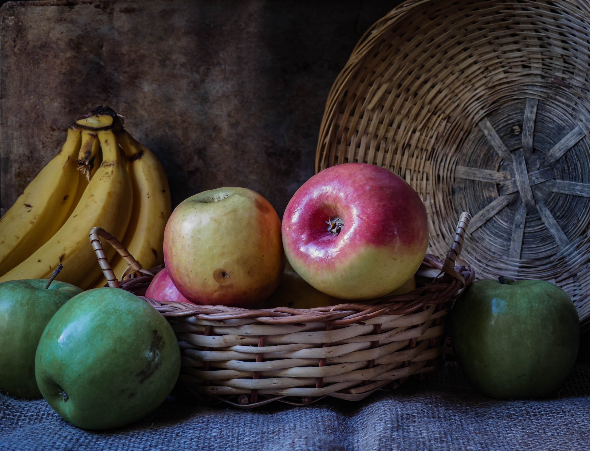

# Web Components by Auroratide

<p hidden><strong><a href="https://auroratide.github.io/web-components/">View this page with live demos!</a></strong></p>

This is just a bunch of highly reusable, fully accessible **[web components](https://developer.mozilla.org/en-US/docs/Web/Web_Components)** you can use on your websites! Why web components?

* It's part of the [HTML Standard](https://html.spec.whatwg.org/#custom-elements), so they work in [every web framework](https://custom-elements-everywhere.com/), or with no framework at all.
* They are [fast and small](https://webcomponents.dev/blog/all-the-ways-to-make-a-web-component/) compared to components in frameworks, since there's zero library overhead.
* They facilitate [progressive enhancement](https://kryogenix.org/code/browser/everyonehasjs.html): viewers get a basic view of content before the Javascript makes it functional.

<small>Made by <a href="https://auroratide.com">Auroratide</a>, a developer with a passion for the web, inclusive design, and storytelling ❤️</small>

## The flip-card Element

**View**: [The flip-card Element](https://auroratide.github.io/web-components/flip-card)

An element that flips beautifully between a front and back side.

<!--DEMO
<wc-demo id="flip-card" class="flip-card-demo">
	<flip-card>
		<section slot="front">
			<p>The front!</p>
		</section>
		<section slot="back">
			<p>The back!</p>
		</section>
	</flip-card>
	<div slot="actions">
		<button>Flip!</button>
	</div>
</wc-demo>
<style>
	#flip-card flip-card {
		--card-depth: 0.5em;
		--corner-granularity: 6;
		width: 100%;
		max-width: 10em;
		height: 12.5em;
		border-radius: 0.5em;
	}
	#flip-card flip-card > section {
		display: flex;
		flex-direction: column;
		align-items: center;
		justify-content: center;
		border: 0.333em solid var(--c-banner);
		color: var(--c-banner-text);
		font-size: var(--f-p1);
	}
	#flip-card flip-card > [slot="front"] {
		background-color: var(--c-primary);
	}
	#flip-card flip-card > [slot="back"] {
		background-color: var(--c-secondary);
	}
	#flip-card flip-card::part(edge) {
		background-color: var(--c-banner);
	}
	#flip-card flip-card p:last-child { margin: 0; }
</style>
/DEMO-->

```html
<flip-card>
	<section slot="front">
		<p>The front!</p>
	</section>
	<section slot="back">
		<p>The back!</p>
	</section>
</flip-card>
```

## The img-zoom Element

**View**: [The img-zoom Element](https://auroratide.github.io/web-components/img-zoom)

An element that accessibly zooms in on an image when the user wants to see more details.

<!--DEMO
<wc-demo id="img-zoom" class="img-zoom-demo">
	
      
   </img-zoom>
</wc-demo>
/DEMO-->

```html

	
</img-zoom>
```

## The reorder-list Element

**View**: [The reorder-list Element](https://auroratide.github.io/web-components/reorder-list)

A set of elements (`reorder-list` and `reorder-item`) that work together to make a rearrangeable list:

<!--DEMO
<wc-demo id="reorder-list">
	<reorder-list>
		<reorder-item>
			<strong>Cobb Salad</strong>
			<ul>
				<li>chicken</li>
				<li>egg</li>
				<li>tomato</li>
			</ul>
		</reorder-item>
		<reorder-item>
			<strong>Fried Rice</strong>
			<ul>
				<li>rice</li>
				<li>shrimp</li>
				<li>egg</li>
			</ul>
		</reorder-item>
		<reorder-item>
			<strong>Chimichanga</strong>
			<ul>
				<li>chicken</li>
				<li>beans</li>
			</ul>
		</reorder-item>
		<reorder-item>
			<strong>Banana Pancake</strong>
			<ul>
				<li>breakfast</li>
				<li>banana</li>
			</ul>
		</reorder-item>
		<reorder-item>
			<strong>Philly Cheese Sandwich</strong>
			<ul>
				<li>steak</li>
				<li>cheese</li>
				<li>bread</li>
			</ul>
		</reorder-item>
	</reorder-list>
</wc-demo>
<style>
	#reorder-list reorder-list {
		list-style: none;
		background: #ddd;
		border-radius: 0.5em;
		width: min(400px, 100%);
		padding: 0.5em;
		display: flex;
		flex-direction: column;
		gap: 0.5em;
	}
	#reorder-list reorder-item {
		background: #fff;
		border-radius: 0.25em;
		padding: 0.5em;
		box-shadow: 0 0.1em 0.15em #0002;
	}
	#reorder-list ul {
		list-style: none;
		display: flex;
		flex-wrap: wrap;
		gap: 0.5em;
		padding: 0;
		margin: 0;
		font-size: 90%;
		color: #2573C1;
	}
</style>
/DEMO-->

```html
<reorder-list>
	<reorder-item>
		<strong>Cobb Salad</strong>
	</reorder-item>
	<reorder-item>
		<strong>Fried Rice</strong>
	</reorder-item>
	<reorder-item>
		<strong>Chimichanga</strong>
	</reorder-item>
	<reorder-item>
		<strong>Banana Pancake</strong>
	</reorder-item>
	<reorder-item>
		<strong>Philly Cheese Sandwich</strong>
	</reorder-item>
</reorder-list>
```

## The tab-list Element

**View**: [The tab-list Element](https://auroratide.github.io/web-components/tab-list)

A set of elements (`tab-list`, `tab-item`, and `tab-panel`) that work together to make a tabbing interface:

<!--DEMO
<wc-demo id="tab-list">
	<div class="tab-container">
		<tab-list aria-label="Fruit dessert recipes">
			<tab-item for="example-4-tab-1" selected>Apples</tab-item>
			<tab-item for="example-4-tab-2">Oranges</tab-item>
			<tab-item for="example-4-tab-3">Bananas</tab-item>
		</tab-list>
		<div class="tab-panels-container">
			<tab-panel id="example-4-tab-1">
				<p>Ingredients for making apple pie:</p>
				<ul>
					<li>8 Granny Smith apples</li>
					<li>½ cup butter</li>
					<li>3 tablespoons flour</li>
					<li>½ cup white sugar</li>
					<li>½ cup brown sugar</li>
					<li>¼ water</li>
					<li>A double-crust pie pastry</li>
				</ul>
			</tab-panel>
			<tab-panel id="example-4-tab-2">
				<p>Ingredients for making orange sorbet:</p>
				<ul>
					<li>2 cups orange juice pulp</li>
					<li>1½ cup almond milk</li>
					<li>1 tablespoon orange zest</li>
					<li>1 tablespoon lemon juice</li>
					<li>¼ teaspoon salt</li>
					<li>1 teaspoon vanilla extract</li>
					<li>½ teaspoon sweetener</li>
				</ul>
			</tab-panel>
			<tab-panel id="example-4-tab-3">
				<p>Ingredients for making banana pudding:</p>
				<ul>
					<li>14 bananas</li>
					<li>5 ounce packet instant vanilla pudding</li>
					<li>2 cups milk</li>
					<li>14 ounce can condensed milk</li>
					<li>1 tablespoon vanilla extract</li>
					<li>12 ounces frozen whipped topping</li>
					<li>16 ounces vanilla wafers</li>
				</ul>
			</tab-panel>
		</div>
	</div>
</wc-demo>
<style>
	#tab-list .tab-container {
		box-shadow: 0 2px 4px hsla(0, 0%, 0%, 0.25);
	}
	#tab-list tab-list {
		background: hsl(210, 68%, 45%);
		gap: 0;
	}
	#tab-list tab-item {
		border: none;
		border-radius: 0;
		background: hsl(210, 68%, 45%);
		color: hsl(0, 0%, 100%);
		padding: 12px 24px;
		border-right: 2px solid hsl(210, 82%, 25%);
	}
	#tab-list tab-item:hover:not([selected]),
	#tab-list tab-item:focus:not([selected]) {
		background: hsl(210, 82%, 25%);
	}
	#tab-list tab-item[selected] {
		background: hsl(0, 0%, 100%);
		border-color: transparent;
		color: hsl(0, 0%, 0%);
	}
	#tab-list .tab-panels-container { display: grid; }
	#tab-list tab-panel {
		grid-area: 1 / 1;
		border: none;
		padding: 12px 24px 24px;
		opacity: 1;
		transition: opacity 0.2s ease-in-out;
		background: hsl(0, 0%, 100%);
	}
	#tab-list tab-panel[hidden] {
		display: block;
		opacity: 0;
	}
	#tab-list tab-panel *:last-child {
		margin: 0;
	}
</style>
/DEMO-->

```html
<tab-list aria-label="Fruit dessert recipes">
	<tab-item for="tab-1" selected>Apples</tab-item>
	<tab-item for="tab-2">Oranges</tab-item>
	<tab-item for="tab-3">Bananas</tab-item>
</tab-list>
<div class="tab-panels-container">
	<tab-panel id="tab-1">
		<p>Ingredients for making apple pie!</p>
	</tab-panel>
	<tab-panel id="tab-2">
		<p>Ingredients for making orange sorbet!</p>
	</tab-panel>
	<tab-panel id="tab-3">
		<p>Ingredients for making banana pudding!</p>
	</tab-panel>
</div>
```

## The table-of-contents Element

**View**: [The table-of-contents Element](https://auroratide.github.io/web-components/table-of-contents)

A component that automatically generates a table of contents.

<!--DEMO
<wc-demo>
	<table-of-contents for="main" aria-label="Demo Table of Contents Element"></table-of-contents>
</wc-demo>
/DEMO-->

```html
<table-of-contents
	for="main"
	aria-label="Table of Contents"
></table-of-contents>
```

## The toggle-switch Element

**View**: [The toggle-switch Element](https://auroratide.github.io/web-components/toggle-switch)

A form control representing something is on or off.

<!--DEMO
<wc-demo>
	<label for="toggle-switch">Fancy Switch</label>
	<toggle-switch id="toggle-switch"></toggle-switch>
	<style>
		#toggle-switch {
			height: 1em;
			vertical-align: middle;
		}
		#toggle-switch::part(track) {
			height: 0.75em;
			border-radius: 1em;
			background-color: hsl(0, 0%, 67%);
			margin: 0.125em 0;
		}
		#toggle-switch::part(slider) {
			width: 1em;
			height: 1em;
			border-radius: 50%;
			background-color: hsl(0, 0%, 100%);
			box-shadow: 0.0625em 0.0625em 0.125em hsla(0, 0%, 0%, 0.25);
			margin: -0.125em 0;
		}
		#toggle-switch[checked]::part(track) {
			background-color: hsl(211, 69%, 57%);
		}
	</style>
</wc-demo>
/DEMO-->

```html
<label for="toggle-switch">Fancy Switch</label>
<toggle-switch id="toggle-switch"></toggle-switch>
```

## The typewritten-text Element

**View**: [The typewritten-text Element](https://auroratide.github.io/web-components/typewritten-text)

An element that types one letter at a time to the screen.

<!--DEMO
<wc-demo id="typewritten-text-demo">
	<div class="sentence">
		<p>Have you tried our</p>
		<ul class="typewriter-cycle">
			<li><typewritten-text class="active">fresh salads? 🥗</typewritten-text></li>
			<li><typewritten-text paused>hearty burgers? 🍔</typewritten-text></li>
			<li><typewritten-text paused>delicious pies? 🥧</typewritten-text></li>
		</ul>
	</div>
</wc-demo>
<style>
	#typewritten-text-demo .sentence p { display: inline; }
	#typewritten-text-demo .typewriter-cycle {
		display: inline-block;
		position: relative;
		width: 20ch;
		list-style: none;
		padding: 0;
		margin: 0;
	}
	#typewritten-text-demo .typewriter-cycle li:not(:first-child) {
		position: absolute;
		inset: 0;
	}
	#typewritten-text-demo typewritten-text { font-weight: bold; }
	#typewritten-text-demo typewritten-text:not(.active) .cursor::after {
		visibility: hidden;
	}
</style>
/DEMO-->

```html
<div class="sentence">
	<p>Have you tried our</p>
	<ul class="typewriter-cycle">
		<li><typewritten-text>fresh salads? 🥗</typewritten-text></li>
		<li><typewritten-text paused>hearty burgers? 🍔</typewritten-text></li>
		<li><typewritten-text paused>delicious pies? 🥧</typewritten-text></li>
	</ul>
</div>
```
