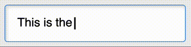

# The typewritten-text Element

<p hidden><strong><a href="https://auroratide.github.io/web-components/typewritten-text">View this page with live demos!</a></strong></p>

The `typewritten-text` element represents text that should be typed out one letter at a time when displayed.



<!--DEMO
<wc-demo id="main-demo">
	<p>This <typewritten-text paused>typewriter effect</typewritten-text> is achieved using <typewritten-text paused>custom elements!</typewritten-text></p>
	<div slot="actions">
		<button class="run">Run</button>
	</div>
</wc-demo>
/DEMO-->

```html
This <typewritten-text paused>typewriter effect</typewritten-text> is achieved
using <typewritten-text paused>custom elements!</typewritten-text>
```

## Installation

You can import through CDN:

```html
<link rel="stylesheet" href="https://unpkg.com/@auroratide/typewritten-text/lib/style.css" />
<script type="module" src="https://unpkg.com/@auroratide/typewritten/lib/define.js"></script>
```

Or, you may install through [NPM](https://www.npmjs.com/package/@auroratide/typewritten-text) and include it as part of your build process:

```
$ npm i @auroratide/typewritten-text
```

```javascript
import '@auroratide/typewritten-text/lib/style.css'
import '@auroratide/typewritten-text/lib/define.js'
```

**Note**: How you import into your project depends on its configuration. The `style.css` file should be imported with your root CSS, and the `define.js` file should imported with your root Javascript.


## Usage

`typewritten-text` is an **inline markup element** that you can use in your HTML document.

```html
Some <typewritten-text>text to type out!</typewritten-text>
```

Since this is Just HTML<sup>TM</sup>, you can use `typewritten-text` with other markup tags:

<!--DEMO
<wc-demo id="markup-demo">
	<p>This works with <typewritten-text paused> <strong>other</strong> <em>markdown</em> <span class="special">elements</span> </typewritten-text> as well!</p>
	<div slot="actions">
		<button class="run">Run</button>
	</div>
</wc-demo>
/DEMO-->

```html
This works with <typewritten-text paused>
	<strong>other</strong>
	<em>markdown</em>
	<span class="special">elements</span>
</typewritten-text> as well!
```

**Note:** `typewritten-text` has text-level semantics, meaning it can contain anything that a `span` can contain. See [Phrasing Content](https://html.spec.whatwg.org/#phrasing-content-2).


### Adjust Timing

Use `type-speed` or `erase-speed` to adjust timing. The time provided is number of milliseconds between each letter.

<!--DEMO
<wc-demo id="speed-demo">
	<ul>
		<li><typewritten-text type-speed="200" erase-speed="30">Slow to type, fast to erase</typewritten-text></li>
		<li><typewritten-text type-speed="30" erase-speed="200">Fast to type, slow to erase</typewritten-text></li>
	</ul>
	<div slot="actions">
		<button class="run">Run</button>
	</div>
</wc-demo>
/DEMO-->

```html
<ul>
	<li><typewritten-text type-speed="200" erase-speed="30">Slow to type, fast to erase</typewritten-text></li>
	<li><typewritten-text type-speed="30" erase-speed="200">Fast to type, slow to erase</typewritten-text></li>
</ul>
```

### Start Paused

When `paused` is specified, it will start paused until invoked by **javascript**.

```html
<p>Some <typewritten-text paused>text to type out!</typewritten-text></p>
```

### Repeat

Use `repeat` to automatically type and erase the phrase. The `repeat-interval` attribute can be used to adjust how long between typing and erasing.

<!--DEMO
<wc-demo id="repeat-demo">
	<p><typewritten-text repeat repeat-interval="1000">It just keeps typing.</typewritten-text></p>
</wc-demo>
/DEMO-->

```html
<p><typewritten-text repeat repeat-interval="1000">It just keeps typing.</typewritten-text></p>
```

### All Attributes

| Attribute | Default | Description |
| ------------- | --------- | ------------- |
| `paused` | - | Whether the animation should start paused |
| `type-speed` | 80 | Time between each letter in milliseconds |
| `erase-speed` | 50 | Time between completion and restart during a repeat loop in milliseconds |
| `repeat` | - | Whether the animation should repeat itself after it types or erases |
| `repeat-interval` | 1000 | Amount of time between typing and erasing when in repeat mode |

## Style API

Since `typewritten-text` is Just HTML<sup>TM</sup>, you can style it the same way you style any HTML tag.

```css
typewritten-text {
	color: red;
}
```

**Note**: Depending on what you want to do, you may run into some [Implementation Gotchas](#implementation-gotchas).

### Cursor

The blinking cursor can be customized with either CSS variables or directly via selectors.

| Variable | Default | Description |
| ------------- | --------- | ------------- |
| `--cursor-width` | 0.125em | How wide the cursor is |
| `--cursor-style` | solid | Whether the cursor is solid, dashed, dotted, etc; can be any border-style value |
| `--cursor-color` | currentColor | Color of the cursor |
| `--cursor-interval` | 0.7s | The duration of the blink animation |

The cursor can be arbitrarily customized with the following CSS selector:

```css
typewritten-text .cursor.current::after { }
```

### Example Fancy Cursor

<!--DEMO
<wc-demo id="cursor-demo">
	<p>Here's a <typewritten-text paused>fancy cursor.</typewritten-text></p>
	<div slot="actions">
		<button class="run">Run</button>
	</div>
</wc-demo>
/DEMO-->

```css
typewritten-text .cursor.current::after {
	border-inline-end: none;
	border-block-end: 0.125em solid red;
	width: 1ch;
	inset-inline-end: -1ch;
}
```

## Javascript API

The element exposes some useful methods to enable custom animation. Once you have obtained a reference to a `TypewrittenTextElement` element:

```js
const elem = document.querySelector('typewritten-text')
```

You can use the following methods:

| Method | Description |
| ------------- | ------------- |
| `type()` | Start typing characters until the end |
| `typeOne()` | Type one character |
| `erase()` | Start erasing characters until the beginning |
| `eraseOne()` | Erase one character |
| `pause()` | Pause the animation cycle if it is currently running |
| `resume()` | If paused while typing, continue typing and vice versa; if paused as a result of reaching the end of either typing or erasing, will perform the opposite action. |
| `switchDirection()` | Switch from typing to erasing or vice versa; can be done in the middle of typing or erasing |
| `reset()` | Completely resets the element and animation; may be useful if the content within the element is dynamic |

### Properties

Each attribute can be accessed as a Javascript property.

* `elem.paused`
* `elem.typeSpeed`
* `elem.eraseSpeed`

Other readonly attributes are provided:

* `elem.length`: The total number of typeable characters
* `elem.position`: The numerical position of the character to type next

### Events

The `typewritten-text` element dispatches the following events:

| Name | When Triggered |
| ------------- | ------------- |
| `type` | Anytime a character is typed into view |
| `typed` | When the full phrase becomes fully typed |
| `typing` | When it starts typing after having been paused |
| `erase` | Anytime a character is removed from view |
| `erased` | When the full phrase becomes erased |
| `erasing` | When it starts erasing after having been paused |
| `resume` | When the animation is started |
| `paused` | When the animation is paused |

### Element Class

The element interface can be accessed in javascript as well, perhaps to be created manually or for typescript type notation.

```js
import { TypewrittenTextElement } from '@auroratide/typewritten-text'
```

## Accessibility

This custom element is built with accessibility in mind!

* The `typewritten-text` element always represents its textual content regardless of visibility state. Screenreaders should read the text in its entirety.
* The textual content can be copied and pasted regardless of visibility state.
* The blinking cursor animation is disabled for people who [prefer reduced motion](https://developer.mozilla.org/en-US/docs/Web/CSS/@media/prefers-reduced-motion)

## Implementation Gotchas

It is possible the non-trivial implementation of `typewritten-text` can lead to unexpected complications with advanced customization.

`typewritten-text` works by **cloning** its inner content into a `mirror` slot, within which each letter is wrapped with a `span`. The following is an example before-and-after of what the resulting markup looks like once the element has finished rendering:

```html
<typewritten-text>Hey</typewritten-text>

<!-- ...becomes... -->

<typewritten-text>Hey<span slot="mirror">
	<span class="cursor current">
	<span class="word">
		<span class="char">H</span>
		<span class="char">e</span>
		<span class="char">y</span>
	</span>
</span></typewritten-text>
```

As a result, a selector like `typewritten-text > span` will have unexpected results.

This architecture has the following explicit goals:

* Preserve, as much as possible, the way the web developer has specified the usage of the element. This means not overriding the default slot of `typewritten-text`.
* Allow the use of semantic markup within `typewritten-text` so it acts as much as possible like a native text-level element.
* Prevent layout shift as a result of characters coming into view; the entire content will exist, but will be invisible until typed.
* Allow CSS customizations of the inner markup to apply. This would not be true if the content was cloned into the element's shadow dom.

## Showcases

Using the Javascript and Styling interfaces allows you to do all sorts of things.

### Typewriter Cycle

You can cycle between different phrases by attaching listeners to the `typed` and `erased` events.

**[View the Typewriter Cycle demo on Codepen!](https://codepen.io/auroratide/pen/BaZWWwQ)**

<!--DEMO
<wc-demo id="cycle-demo">
	<div class="sentence">
		<p>Have you tried our</p>
		<ul class="typewriter-cycle">
			<li><typewritten-text class="active">fresh salads? 🥗</typewritten-text></li>
			<li><typewritten-text paused>hearty burgers? 🍔</typewritten-text></li>
			<li><typewritten-text paused>delicious pies? 🥧</typewritten-text></li>
		</ul>
	</div>
</wc-demo>
/DEMO-->

```html
<div class="sentence">
	<p>Have you tried our</p>
	<ul class="typewriter-cycle">
		<li><typewritten-text class="active">fresh salads? 🥗</typewritten-text></li>
		<li><typewritten-text paused>hearty burgers? 🍔</typewritten-text></li>
		<li><typewritten-text paused>delicious pies? 🥧</typewritten-text></li>
	</ul>
</div>
```

```css
.sentence p { display: inline; }

.typewriter-cycle {
	display: inline-block;
	position: relative;
	width: 20ch;
	list-style: none;
	padding: 0;
	margin: 0;
}

.typewriter-cycle li:not(:first-child) {
	position: absolute;
	inset: 0;
}

typewritten-text { font-weight: bold; }
typewritten-text:not(.active) .cursor::after {
	visibility: hidden;
}
```

```js
document.querySelectorAll(".typewriter-cycle").forEach((cycle) => {
	const items = cycle.querySelectorAll("typewritten-text")
	for (let i = 0; i < items.length; ++i) {
		const cur = items[i]
		const next = items[(i + 1) % items.length]

		cur.addEventListener("typed", () => setTimeout(() => cur.erase(), cur.repeatInterval))
		cur.addEventListener("erased", () => {
			cur.classList.remove("active")
			next.classList.add("active")
			setTimeout(() => next.type(), next.repeatInterval)
		})
	}
})
```

### Dialog

Dialog is often portrayed as typewritten text in games. Using the `typed` event, you can chain several together.

**[View the Dialog demo on Codepen!](https://codepen.io/auroratide/pen/rNwyYyW)**

<!--DEMO
<wc-demo id="dialog-demo">
	<section id="janet" style="--bubble: oklch(83% 0.041 227);">
		<figure>
			
			<figcaption>Janet</figcaption>
		</figure>
		<blockquote><typewritten-text type-speed="45" paused>Hi! I'm <strong>Janet</strong>, the new gal on the team. What's your name?</typewritten-text></blockquote>
	</section>
	<section id="dinesh" class="flipped" style="--bubble: oklch(80% 0.024 34);">
		<blockquote><typewritten-text type-speed="50" paused>I'm <strong>Dinesh</strong>, the UI designer. The first thing you should know is our team lead is always <em>at least</em> five minutes late.</typewritten-text></blockquote>
		<figure>
			
			<figcaption>Dinesh</figcaption>
		</figure>
	</section>
	<div slot="actions">
		<button class="rerun">Rerun</button>
	</div>
</wc-demo>
/DEMO-->

```js
const janet = document.querySelector("#janet typewritten-text")
const dinesh = document.querySelector("#dinesh typewritten-text")

janet?.addEventListener("typed", () => {
	timeout = setTimeout(() => dinesh?.type(), dinesh?.repeatInterval)
})
```
